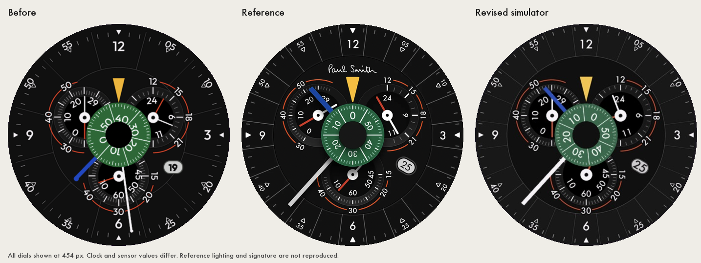

# Trio Chrono visual review

The comparison uses the supplied screenshot, with each dial scaled to 454 × 454 px. The reference is [Paul Smith Watch Face by yuhang](https://dribbble.com/shots/20290682-Paul-Smith-Watch-Face), whose description names Futura. Measurements below refer to the screen, excluding the watch bezel.

| Element | Before | Revised |
| --- | --- | --- |
| Numerals | Outfit | Futura Medium, centred on visible ink |
| Cardinal type size | 28 px | 24 px |
| Rim type size | 19 px | 16 px |
| Subdial type size | 19 px | 17 px |
| Rim divisions | 12, starting at 15° | 24, starting at 7.5° |
| Inner circle radius | 138.5 px | 162.3 px |
| Top subdial centres | (157, 191), (297, 191) | (157, 187), (297, 187) |
| Bottom subdial centre | (227, 311) | (227, 308) |
| Green disc radius | 66 px | 64.5 px |
| Disc numeral radius | 33 px | 40 px |
| Minute hand | 198 × 4 px, round tip | 192 × 8 px, flat tip |
| Hour hand | 124 × 8 px, round tip | 128 × 8 px, flat tip |
| Date surround | 41 × 28 px, horizontal | 38 × 26 px, tilted 30° |
| Date centre | (338, 293) | (337, 291) |

The renderer, Monkey C view and design sheet use the revised measurements. The palette is closer to the reference's muted green, red and blue. The date uses one atlas with 31 numbers in each ink colour; its tilt and centring are baked at four times the screen resolution.

Validation on 2026-09-19:

- `scripts/face.sh build trio-chrono` passed for the Forerunner 965.
- Wake and always-on modes displayed in the simulator without runtime errors. The date appeared in both modes. [Wake capture](trio-chrono-simulator-wake.png), [always-on capture](trio-chrono-simulator-aod.png).
- All 62 date cells contain ink, with at least 2 px clear on each edge.
- None of the eight rim numeral masks overlap their triangle masks, checked at the renderer's 4× resolution.
- The white static dial was inspected. The simulator's property editor stopped responding, so the white theme was not checked live.
- The always-on dial bitmap contains 8,672 lit pixels (4.2% of the screen), before adding the disc and hands. This is not a measurement of the complete live frame.
- Python syntax and `git diff --check` passed.
- Regenerating the artwork produced identical PNGs. The design sheet's JavaScript passed `node --check`.
- The compiled app was copied to a physical Forerunner 965 over MTP. Reading the file back produced an exact byte match and the same SHA-256 hash. Activation and rendering on the watch have not been confirmed.

This is a measured layout correction, not proof of identical pixels. The reference is a scaled photograph with lighting, antialiasing and a signature that this face does not reproduce. Clock and sensor values also differ. The saved simulator captures have screenshot compression and must not be used to count always-on pixels.
